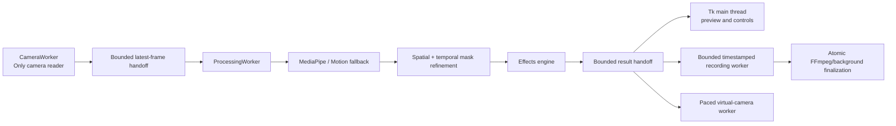

<div align="center">


# 👻 Real-Time-AI-Invisibility-Visual-Effects-Studio

### Real-Time AI Invisibility & Visual Effects Studio

*A threaded, versioned, reliability-focused computer-vision desktop app — built on MediaPipe and OpenCV.*

[](https://www.python.org/)
[](https://opencv.org/)
[](https://developers.google.com/mediapipe)
[](#-installation)
[](LICENSE)
[](#)
[](#)
[](#)
[](#)

[Features](#-features) • [Screenshots](#-screenshots) • [Installation](#-installation) • [Architecture](#-architecture) • [Effects](#-effects) • [Contributing](#-contributing)

</div>

> **Note:** Replace `<your-username>/<your-repo>` in the badge URLs above with your actual GitHub path so the star/fork/issue counts populate correctly.

---

## 📖 Introduction

**PhantomVision Studio** is a real-time desktop computer-vision application that makes a person (or a captured region of a scene) appear to vanish from the live camera feed, along with four related visual effects. It exists to take a common "invisibility cloak" OpenCV demo and turn it into something that survives real usage — a dropped camera, a resized window, a corrupted settings file, a slow encoder — without corrupting the preview or crashing the app.

Camera capture, AI inference, recording, audio finalization, and virtual-camera output all run on dedicated background workers instead of the UI thread, and every processed frame is tagged with a pipeline/background version so stale results from a previous camera, effect, or background are automatically discarded rather than flashed on screen.

It's built on **Python**, **OpenCV**, and **MediaPipe Selfie Segmentation**, with a **Tkinter** desktop interface.

> [!NOTE]
> This project uses classical CV + MediaPipe segmentation, not a diffusion or matting foundation model. See [Current Limitations](#️-current-limitations) for what that does and doesn't mean in practice.

---

## ✨ Features

<table>
<tr><td width="50%" valign="top">

### 🧠 AI & Vision
- ✅ MediaPipe Selfie Segmentation with automatic Motion Fallback
- ✅ Spatial + temporal mask refinement (Fast / Balanced / Quality presets)
- ✅ Joint-angle + handedness + temporal-voting gesture classification
- ✅ Model/backend status manager with real init checks

### 🎨 Visual Effects
- ✅ AI Invisibility, Color Cloak, Ghost Trail, Motion Mask, Time Freeze
- ✅ Edge shrink/expand, feathering, temporal stability controls
- ✅ Raw, mask, alpha, final, and split before/after preview modes

### 🖱️ Interactive Editing
- ✅ Click-to-select a detected target
- ✅ Add/remove brushes with adjustable size
- ✅ Undo, redo, and clear-selection

</td><td width="50%" valign="top">

### 🎥 Camera
- ✅ Configurable source scanning (indices 0–9)
- ✅ 480p / 720p / 1080p, target FPS, backend, buffer, exposure, focus
- ✅ Bounded exponential-backoff reconnect on disconnect

### 🔴 Recording & Output
- ✅ MP4 recording with optional microphone audio
- ✅ Transparent target PNG export
- ✅ Optional virtual-camera output (paced, bounded queue)

### 📊 Diagnostics & Reliability
- ✅ Capture/processing FPS, average & P95 latency, drop counters
- ✅ JSON diagnostic reports
- ✅ Schema-validated, migration-safe, corruption-tolerant settings
- ✅ Named presets, keyboard shortcuts, rotating logs

</td></tr>
</table>

---

## 🖼️ Screenshots

<div align="center">

| Main Interface | AI Invisibility | Color Cloak |
|:---:|:---:|:---:|
|  | *(placeholder — add screenshot)* | *(placeholder — add screenshot)* |

| Ghost Trail | Motion Mask | Time Freeze |
|:---:|:---:|:---:|
| *(placeholder — add screenshot)* | *(placeholder — add screenshot)* | *(placeholder — add screenshot)* |

| Mask Editor | Recording | Diagnostics |
|:---:|:---:|:---:|
| *(placeholder — add screenshot)* | *(placeholder — add screenshot)* | *(placeholder — add screenshot)* |

</div>

> Only `docs/screenshots/advanced-ui.png` currently exists in the repo. Drop additional PNGs into `docs/screenshots/` and update the table above as they're captured.

---

## 🎬 Demo

<div align="center">

*(placeholder — embed a demo GIF here, e.g. `docs/screenshots/demo.gif`)*

[](#) &nbsp; *(placeholder link)*

</div>

---

## 🚀 Installation

**Requirements:** Python 3.10–3.13 (per `pyproject.toml`). Optional-feature availability is determined by actual package initialization at runtime, not a hardcoded version check.

### Recommended (Windows, full feature set)

```powershell
git clone https://github.com/<your-username>/<your-repo>.git
cd <your-repo>

py -3.11 -m venv .venv
.venv\Scripts\Activate.ps1
python -m pip install --upgrade pip
python -m pip install -r requirements.txt

python app.py
```

Pinned direct dependencies are also available in `requirements.lock`.

### Minimal (OpenCV-only)

Keeps Color Cloak, Ghost Trail, Motion Mask, Time Freeze (Motion Fallback), screenshots, and diagnostics — without MediaPipe:

```powershell
python -m pip install -e .
python app.py
```

<details>
<summary><b>Optional-feature notes</b></summary>

| Feature | Requires |
|---|---|
| Microphone recording | `sounddevice` — without it, video records without audio |
| Combined audio in MP4 | `ffmpeg` on `PATH` — without it, a separate WAV file is kept |
| Virtual camera | `pyvirtualcam` **and** a compatible virtual-camera backend/driver (e.g. OBS Virtual Camera) |
| GPU status | Standard pip OpenCV wheels are CPU builds. CUDA-capable runtimes are detected and reported, but never falsely marked as active |

</details>

---

## 🧭 How It Works

1. **Capture** — `CameraWorker` is the sole camera reader and hands off the latest frame through a bounded queue.
2. **Infer** — `ProcessingWorker` runs MediaPipe Selfie Segmentation (or Motion Fallback) on the frame.
3. **Refine** — The raw mask goes through spatial + temporal refinement at the selected quality preset.
4. **Composite** — The active effect (from `effects.py`) blends the refined mask with the background/frame.
5. **Version-check** — Every result carries pipeline and background version tags; stale results are discarded.
6. **Deliver** — Results flow to the Tk preview, the recording worker, and/or the virtual-camera worker in parallel.

---

## 🏗️ Architecture



| Stage | Responsibility |
|---|---|
| **CameraWorker** | Sole camera reader; handles reconnect, backoff, buffer clearing |
| **ProcessingWorker** | Runs inference, applies mode-aware config, versions every result |
| **MediaPipe / Motion Fallback** | Person segmentation, with a classical fallback when unavailable |
| **Mask refinement** | Spatial + temporal smoothing at Fast/Balanced/Quality presets |
| **Effects engine** | Applies the selected effect's compositing logic |
| **Recorder** | Timestamp-paced encoding, atomic file finalization |
| **Virtual camera** | Paced, bounded-queue output to a virtual camera device |
| **UI (Tk main thread)** | Preview, controls, warnings — never blocked by capture/processing |

### Project structure

```text
PhantomVision-Studio/
├── app.py                # UI, user actions, state, preview, warnings, output controls
├── workers.py             # Versioned camera/inference workers, lifecycle states, bounded queues
├── effects.py              # MediaPipe wrappers, gestures, mask refinement, compositing
├── recording.py             # Timestamp-paced recording, finalization, virtual-camera output
├── settings.py                # Schema-validated preferences, corrupt-file recovery, presets
├── utils.py                     # Coordinate mapping, background quality, diagnostics, safe I/O
├── tests/                         # Headless automated tests (effects, workers, utils, robustness)
├── docs/screenshots/                # README screenshots
├── requirements.txt                   # Full pinned dependency set
├── requirements.lock                   # Pinned direct dependencies
├── requirements-dev.txt                  # Development/test dependencies
├── pyproject.toml                          # Package metadata, optional dependency groups
└── LICENSE                                  # MIT
```

---

## 🎭 Effects

| Effect | Description | Requires Background | Gesture Support | Real-Time | Current Backend |
|---|---|:---:|:---:|:---:|---|
| **AI Invisibility** | MediaPipe Selfie Segmentation, with Motion Fallback | ✅ | ✅ | ✅ | MediaPipe / Motion Fallback |
| **Color Cloak** | HSV color keying with patch sampling and hue wraparound | ✅ | ✅ | ✅ | OpenCV (HSV) |
| **Ghost Trail** | Temporal frame accumulation | ❌ | ✅ | ✅ | OpenCV |
| **Motion Mask** | LAB background difference with refined temporal mask | ✅ | ✅ | ✅ | OpenCV (LAB diff) |
| **Time Freeze** | Saved live frame plus the latest real target matte | ❌ after freezing | ✅ | ✅ | OpenCV + mask compositing |

Gesture controls: pinch adjusts transparency, finger-count switches effect tabs — classified using joint angles, handedness metadata, and temporal voting.

---

## ⚡ Performance

Live FPS depends on camera resolution, CPU, MediaPipe availability, recording, and preview mode. Fill in the table below using the in-app **Diagnostics** report for your machine:

| Resolution | Capture FPS | Processing FPS | Avg Latency | P95 Latency |
|---|:---:|:---:|:---:|:---:|
| 480p | *(measure via Diagnostics)* | *(measure via Diagnostics)* | *(measure via Diagnostics)* | *(measure via Diagnostics)* |
| 720p | *(measure via Diagnostics)* | *(measure via Diagnostics)* | *(measure via Diagnostics)* | *(measure via Diagnostics)* |
| 1080p | *(measure via Diagnostics)* | *(measure via Diagnostics)* | *(measure via Diagnostics)* | *(measure via Diagnostics)* |

---

## ⌨️ Keyboard Shortcuts

| Shortcut | Action |
|---|---|
| `Ctrl+S` | Save screenshot |
| `Ctrl+Z` / `Ctrl+Y` | Undo / redo target edit |
| `Space` | Start background-capture countdown |
| `F` | Freeze current target |
| `R` | Start/stop recording |
| `D` | Export diagnostic report |
| `1`–`5` | Switch effect tabs |

---

## 🛠️ Technologies

| Technology | Role |
|---|---|
| **Python** | Core application language |
| **OpenCV** (`opencv-contrib-python`) | Capture, image processing, compositing, HSV/LAB effects |
| **MediaPipe** | Selfie Segmentation and hand-landmark gesture detection |
| **NumPy** | Array and mask processing |
| **Pillow** | Converting frames for the Tkinter preview |
| **Tkinter** | Desktop UI framework |
| **Threading** | Dedicated workers for camera, processing, recording, and virtual-camera output, keeping the UI thread free |

---

## 📋 Usage

1. Open the **Camera** page and set the source, resolution, FPS, backend, exposure, and focus.
2. For AI Invisibility, Color Cloak, or Motion Mask, click **Capture Background (3s)** and step out of frame during the countdown.
3. Select an effect in the **Effects** page.
4. Choose a preview type from the toolbar (raw / mask / alpha / final / split).
5. For Color Cloak, use **Color Sample** and click the cloth — red hues crossing HSV 0/179 are handled correctly.
6. Use **Select Target**, **Brush Add**, or **Brush Remove** to correct the mask. Undo/redo are available.
7. In Time Freeze, wait until the target indicator shows tracked, then press **Freeze Current Ghost**.
8. Use the bottom actions to screenshot, record, export transparency, or generate diagnostics.

### Background quality & camera movement

Background capture uses the temporal median of recent worker frames, scored for motion, sharpness, and exposure. After capture, feature-based motion estimation flags meaningful camera movement with a recalibration warning. For best results: keep the camera fixed, avoid moving objects in the hidden region, use even lighting, ensure the full target is visible before freezing, and recapture after moving the camera.

---

## ⚠️ Current Limitations

- Invisibility reconstructs the target region from a captured static background — it does not generate unseen scene content.
- Strong camera translation, parallax, lighting changes, reflections, and moving background objects can expose artifacts.
- MediaPipe Selfie Segmentation is designed for people, not arbitrary-object segmentation.
- Click-to-select chooses a connected component from the current mask; it is not semantic object selection.
- Fine hair, transparent materials, heavy motion blur, and hard shadows remain difficult cases.
- Live FPS depends on camera resolution, CPU, MediaPipe availability, recording, and preview mode.

---

## 🗺️ Roadmap

- [ ] Better GPU acceleration support
- [ ] PySide6-based UI option
- [ ] Additional export formats
- [ ] Plugin system for custom effects
- [ ] Advanced mask editing tools
- [ ] Improved recording pipeline
- [ ] Expanded diagnostics reporting

---

## 🧪 Testing

```powershell
# Headless unittest suite
python -m unittest discover -s tests -v

# Or with pytest
python -m pip install -r requirements-dev.txt
pytest
```

<details>
<summary><b>What the suite covers</b></summary>

- Mask dimensions, clipping, data types, component cleanup, soft edges
- Alpha and Time Freeze compositing correctness
- Background/frame resolution mismatch, missing/empty masks, invalid model results
- Letterboxed click mapping, red HSV wraparound
- Median background construction and quality fields
- Camera-open failures, temporary read recovery, persistent-failure transitions, buffer clearing, restart-without-duplicate-loop
- Pipeline/background version propagation and stale-result rejection
- Typed processing-configuration clamping and mode-aware inference
- Settings validation, corrupt-file preservation, schema-safe save/load
- Threaded recording finalization, timestamp duplication, virtual-camera pacing
- NaN/infinity mask handling, randomized invalid-mask inputs
- Motion fallback behavior, gesture temporal debounce
- Screenshot write failures, diagnostics JSON output
- CPU/GPU runtime detection fallback
- Recording and virtual-camera initialization failures

</details>

> A webcam, microphone, and virtual-camera driver can't be exercised by the headless suite — use in-app **Diagnostics** to verify hardware paths on the target machine.

---

## 🔧 Troubleshooting

<details>
<summary><b>Camera does not open</b></summary>

- Try `DSHOW`, `MSMF`, and `Auto` from the Camera page.
- Close other applications that may already own the webcam.
- Increase the scan maximum if the device has a higher index.
- Apply 640×480 at 30 FPS first, then increase resolution.
- Export Diagnostics and inspect the rotating log.
</details>

<details>
<summary><b>AI tab uses Motion Fallback</b></summary>

Open **Model Manager** and confirm MediaPipe initialized successfully. Reinstall pinned requirements in a clean virtual environment if it's unavailable — the app never claims MediaPipe is active after a failed initialization.
</details>

<details>
<summary><b>Virtual camera does not start</b></summary>

Installing `pyvirtualcam` alone isn't always sufficient — install and enable a compatible virtual-camera backend/driver, and restart apps such as OBS, Zoom, or Teams afterward.
</details>

<details>
<summary><b>Recording has no combined audio</b></summary>

Requires a working microphone via `sounddevice` and `ffmpeg` on `PATH`. Without FFmpeg, video still saves and audio stays in a separate WAV file.
</details>

<details>
<summary><b>CUDA is detected but inference stays on CPU</b></summary>

The standard OpenCV wheel and current MediaPipe backend aren't automatically converted into CUDA inference. GPU status is diagnostic-only — the UI never labels a backend as GPU-active without a real initialized GPU implementation.
</details>

---

## 📂 Logs & Saved Settings

Runtime files live outside the repository and rotate automatically:

```text
~/.ghost_invisibility_mode/settings.json
~/.ghost_invisibility_mode/presets.json
~/.ghost_invisibility_mode/logs/ghost_invisibility.log
```

---

## 🤝 Contributing

Contributions are welcome!

1. Fork the repository and create a feature branch.
2. Make your changes, keeping existing effects and architecture intact.
3. Run the test suite (`pytest` or `python -m unittest discover -s tests -v`) and add tests for new behavior.
4. Open a pull request describing the change and its motivation.

Please file bugs and feature requests via GitHub Issues, including your Diagnostics report when relevant.

---

## 📜 Dependency & Model Licensing

| Component | Role | Upstream license note |
|---|---|---|
| MediaPipe | Person segmentation and hand landmarks | Apache-2.0 project; review upstream notices when redistributing |
| OpenCV | Capture, image processing, compositing | Apache-2.0 project |
| NumPy | Array processing | BSD-style project license |
| Pillow | Tk preview conversion | HPND-style project license |
| pyvirtualcam | Optional virtual camera | MIT project |
| This repository | Application code and tests | MIT — see [`LICENSE`](LICENSE) |

## ✅ Validation Status

The included release was syntax-checked, launched in a headless desktop session, and passed all 45 automated tests. That environment had no physical webcam, microphone, Windows camera backend, or virtual-camera driver, so those hardware paths should be verified on the target Windows machine using the built-in **Diagnostics** report.

## 📄 License

MIT — see [`LICENSE`](LICENSE).

<div align="center">

Made with 👻 and OpenCV.

</div>
