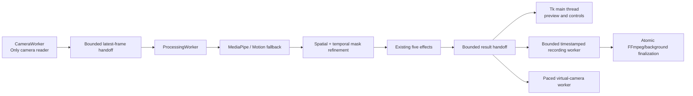

# Ghost / Invisibility Mode — Advanced Reliability Edition

A real-time desktop computer-vision application that preserves the original five effects while fixing the critical capture, mask, coordinate-mapping, gesture, compositing, lifecycle, and stale-state defects. Camera capture, frame processing, recording, audio finalization, and virtual-camera pacing run outside the Tk main thread. Every processing result carries pipeline and background versions, so output created for an old camera, effect, background, or control state is rejected.


## Existing effects preserved

| Mode | Current implementation | Background required |
|---|---|---|
| AI Invisibility | MediaPipe Selfie Segmentation, with Motion Fallback when needed | Yes |
| Color Cloak | HSV color keying with patch sampling and hue wraparound | Yes |
| Ghost Trail | Temporal frame accumulation | No |
| Motion Mask | LAB background difference with refined temporal mask | Yes |
| Time Freeze | Saved live frame plus the latest real target matte | No after freezing |

No new large AI model or unrelated effect was added. The project still uses its original MediaPipe/OpenCV approach.

## Important fixes

- **Time Freeze now uses a real person/target mask.** It no longer invents a blurred circle when no matte exists.
- **Frozen soft edges are composited once.** The previous `frame × mask²` dark-edge defect is removed.
- **Preview clicks map through the actual letterboxed render rectangle.** Clicks outside the displayed image are ignored.
- **Color sampling uses the median of an 11×11 patch**, rather than one noisy pixel.
- **Only `CameraWorker` reads the camera.** Background capture uses recent worker frames and a temporal median.
- **Inference and display frames are separate.** Hand landmarks cannot contaminate model input or effect masks.
- **Pinch adjusts transparency; finger-count gestures switch tabs.** The two controls no longer conflict.
- **Gesture classification uses joint angles, handedness metadata, and temporal voting** instead of only vertical landmark comparisons.
- **Resolution changes are handled safely** by resizing masks/backgrounds where required.
- **Camera disconnects trigger bounded exponential-backoff reconnect attempts**, temporary read failures are tolerated, old camera buffers are cleared on restart, and a previous capture loop must stop before another starts.
- **Camera and processing workers use explicit lifecycle states and startup handshakes.** The UI only reports a camera as running after it really opens.
- **Processing is versioned.** Results generated before a camera, effect, background, preset, or mask change are discarded.
- **Only the active effect's required processing runs.** Ghost Trail and other classical modes no longer invoke person segmentation unnecessarily.
- **Settings are schema-validated and migrated safely.** Corrupt settings are preserved with a timestamp before defaults are restored.
- **Recording and virtual-camera output are threaded and bounded.** Slow encoding or output devices do not block the interface.

## Advanced interface

The UI now includes:

- Raw, mask, alpha, final, and split before/after previews.
- Click-to-select a connected detected target.
- Add/remove target brushes with adjustable size.
- Undo, redo, and clear-selection controls.
- Fast, Balanced, and Quality mask-refinement presets.
- Model backend selector: Auto, MediaPipe Selfie, or Motion Fallback.
- Edge shrink/expand, feathering, and temporal-stability controls.
- Configurable camera source scanning (default indices 0–9).
- 480p, 720p, and 1080p choices; target FPS, backend, buffer, exposure, and focus controls.
- Three-second background countdown with quality/confidence scoring.
- Camera-movement and target-loss warnings.
- Capture FPS, processing FPS, average and P95 latency, detailed dropped-frame counters, and detected GPU memory.
- MP4 recording, optional microphone audio, transparent target PNG export, and optional virtual-camera output.
- Saved named presets and persistent application settings.
- Model/extension status manager and JSON diagnostic reports.
- Keyboard shortcuts.

### Keyboard shortcuts

| Shortcut | Action |
|---|---|
| `Ctrl+S` | Save screenshot |
| `Ctrl+Z` / `Ctrl+Y` | Undo / redo target edit |
| `Space` | Start background-capture countdown |
| `F` | Freeze current target |
| `R` | Start/stop recording |
| `D` | Export diagnostic report |
| `1`–`5` | Switch effect tabs |

## Architecture



### Main files

| File | Responsibility |
|---|---|
| `app.py` | UI, user actions, state, preview, warnings, output controls |
| `workers.py` | Versioned camera/inference workers, typed configuration, lifecycle states, bounded queues, and recovery |
| `effects.py` | MediaPipe wrappers, gestures, mask refinement, and effect compositing |
| `recording.py` | Timestamp-paced recording, background finalization, atomic publication, and paced virtual-camera output |
| `settings.py` | Schema-validated preferences, corrupt-file recovery, migration, and named presets |
| `utils.py` | Coordinate mapping, background quality, diagnostics, and safe file output |
| `tests/` | Headless automated tests for effects, workers, utilities, and failure paths |

## Installation

Python 3.10–3.13 is supported by the project configuration. Availability of a particular optional backend is determined by actual package initialization at runtime, not by a hardcoded Python-version warning.

### Recommended Windows setup

```powershell
py -3.11 -m venv .venv
.venv\Scripts\Activate.ps1
python -m pip install --upgrade pip
python -m pip install -r requirements.txt
python app.py
```

The pinned direct dependencies are also stored in `requirements.lock`.

### Minimal OpenCV-only setup

This keeps Color Cloak, Ghost Trail, Motion Mask, Time Freeze with Motion Fallback, screenshots, and diagnostics:

```powershell
python -m pip install -e .
python app.py
```

### Optional-feature notes

- Microphone recording uses `sounddevice`. When unavailable, video recording continues without audio.
- Combining microphone audio into the MP4 requires `ffmpeg` on `PATH`. Without it, the application keeps a separate WAV file.
- Virtual-camera output uses `pyvirtualcam` and also requires a compatible virtual-camera backend/driver, such as an installed OBS virtual camera.
- The standard pip OpenCV wheels are CPU builds. The interface detects CUDA-capable runtimes when present but does not falsely claim that MediaPipe is using CUDA.

## Usage

1. Open the **Camera** page and apply the desired source, resolution, FPS, backend, exposure, and focus settings.
2. For AI Invisibility, Color Cloak, or Motion Mask, click **Capture Background (3s)** and leave the camera view during the countdown.
3. Select an effect in the **Effects** page.
4. Choose a preview type from the toolbar.
5. For Color Cloak, choose **Color Sample** and click the cloth. Red hues that cross HSV 0/179 are handled correctly.
6. Use **Select Target**, **Brush Add**, or **Brush Remove** to correct a current mask. Undo and redo are available.
7. In Time Freeze, stand in view until the target indicator says tracked, then press **Freeze Current Ghost**.
8. Use the bottom actions to capture, record, export transparency, or generate diagnostics.

## Background quality and camera movement

Background capture uses the temporal median of recent worker frames. The interface scores motion, sharpness, and exposure to display a rough background-confidence rating. After a background has been captured, feature-based motion estimation checks for meaningful camera movement and displays a recalibration warning.

This remains a clean-plate system. For best results:

- Keep the camera fixed after capturing the background.
- Avoid moving objects in the hidden region.
- Use even lighting.
- Ensure the whole target is visible before freezing.
- Recapture the background after moving or changing camera settings.

## Recording and transparency

- **Screenshot** writes the final processed frame and checks OpenCV’s return value.
- **Transparent PNG** exports the current raw target with the latest alpha mask.
- **Recording** queues timestamped processed frames to a dedicated encoder. Missing frames are paced safely, microphone audio is captured when available, FFmpeg muxing runs outside the UI thread, and the final file is published atomically.
- **Virtual camera** uses a bounded output queue and the backend's frame-pacing method when supported.

## Testing

Run the complete headless test suite:

```powershell
python -m unittest discover -s tests -v
```

Or install development dependencies and use pytest:

```powershell
python -m pip install -r requirements-dev.txt
pytest
```

The suite covers:

- Mask dimensions, clipping, data types, component cleanup, and soft edges.
- Correct alpha and Time Freeze compositing.
- Background/frame resolution mismatch.
- Missing and empty masks.
- Invalid model results.
- Letterboxed click mapping.
- Red HSV wraparound.
- Median background construction and quality fields.
- Camera-open failures, temporary read recovery, persistent failure transitions, buffer clearing, and worker restarts without duplicate capture loops.
- Pipeline/background generation propagation and stale-result matching.
- Typed processing-configuration clamping and mode-aware inference.
- Settings validation, corrupt-file preservation, and schema-safe save/load.
- Threaded recording finalization, timestamp duplication, and virtual-camera pacing.
- NaN/infinity mask handling and randomized invalid-mask inputs.
- Motion fallback behavior.
- Gesture temporal debounce.
- Screenshot write failures.
- Diagnostics JSON output.
- CPU/GPU runtime detection fallback.
- Recording and virtual-camera initialization failures.

A webcam, microphone, and virtual-camera driver cannot be exercised by the headless automated suite. Use **Diagnostics** in the application to record actual device status and live performance.

## Logs and saved settings

Runtime files are kept outside the repository:

```text
~/.ghost_invisibility_mode/settings.json
~/.ghost_invisibility_mode/presets.json
~/.ghost_invisibility_mode/logs/ghost_invisibility.log
```

Logs rotate automatically instead of growing indefinitely.

## Current limitations

- Invisibility still reconstructs the target region from a captured static background; it does not generate unseen scene content.
- Strong camera translation, parallax, lighting changes, reflections, and moving background objects can expose artifacts.
- MediaPipe Selfie Segmentation is designed for people, not arbitrary-object segmentation.
- Click-to-select chooses a connected component from the currently available mask; it is not SAM-style semantic object selection.
- Fine hair, transparent materials, severe motion blur, and hard shadows remain difficult.
- Live FPS depends on camera resolution, CPU, MediaPipe availability, recording, and preview mode.

## Troubleshooting

### Camera does not open

- Try `DSHOW`, `MSMF`, and `Auto` from the Camera page.
- Close applications that may already own the webcam.
- Increase the scan maximum when the device has a higher index.
- Apply 640×480 at 30 FPS first, then increase the resolution.
- Export Diagnostics and inspect the rotating log.

### AI tab uses Motion Fallback

Open **Model Manager** and confirm that MediaPipe initialized successfully. Reinstall the pinned requirements in a clean virtual environment when it is unavailable. The application does not pretend that the MediaPipe backend is active after initialization fails.

### Virtual camera does not start

Installing `pyvirtualcam` alone is not always sufficient; install and enable a compatible virtual-camera backend/driver. Restart applications such as OBS, Zoom, or Teams after the virtual device has been installed.

### Recording has no combined audio

The application needs a working microphone through `sounddevice` and FFmpeg on `PATH`. When FFmpeg is missing, video is still saved and microphone audio remains in a separate WAV file.

### CUDA is detected but inference remains on CPU

The standard OpenCV wheel and the current MediaPipe backend are not automatically converted into CUDA inference by this project. GPU status is diagnostic information only; the UI never labels a backend as GPU-active without a real initialized GPU implementation.

## Dependency and model licensing

| Component | Role | Upstream license note |
|---|---|---|
| MediaPipe | Person segmentation and hand landmarks | Apache-2.0 project; review upstream notices when redistributing |
| OpenCV | Capture, image processing, compositing | Apache-2.0 project |
| NumPy | Array processing | BSD-style project license |
| Pillow | Tk preview conversion | HPND-style project license |
| pyvirtualcam | Optional virtual camera | MIT project |
| This repository | Application code and tests | MIT; see `LICENSE` |

## Validation status

The included release was syntax-checked, launched in a headless desktop session, and passed all 45 automated tests. That environment did not provide a physical webcam, microphone, Windows camera backend, or virtual-camera driver, so those hardware paths must be verified on the target Windows machine with the built-in Diagnostics report.

## License

MIT. See `LICENSE`.
